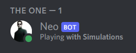
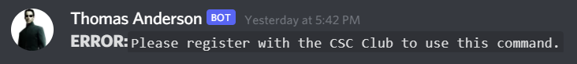
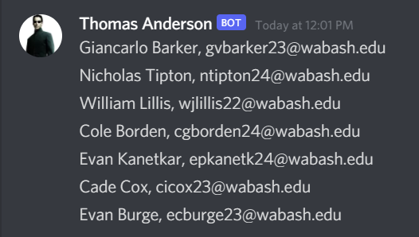

# How to Sign-In to Meetings
1. Open Discord
2. Naviagte to the CSC-Club Server
3. Click the "Show Member List Button"
    

            
    

4. Click on "Neo" in the member list

    

            
    

5. Message Neo the "Seceret Code" for the meeting.
6. Neo will confirm that you are signed in with the following message:
    

            
    

**If you recieve an error**, this means you are not registred as a memeber of the CSC Club and will need to write your name and email on the paper at the front of the room.
    

            
    

**If you would like to be a memeber** so that you will be notified of future events and can sign in using the bot, please contact the President of the Club.

Using this command sends the Leaders of the club your name and email to speed up the process of collecting names. 
    

            
    
